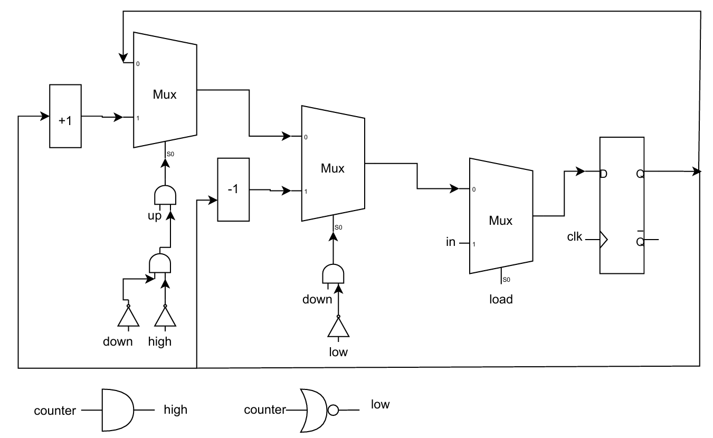

Description:
This project contains a 5-bit synchronous up/down counter written in Verilog. The counter can load an initial value, increment, or decrement depending on control signals. It also provides flags to indicate when the counter reaches its maximum (31) or minimum (0) value.

Module: Up_Dn_Counter
Inputs
•	in [4:0] – 5-bit input value to load into the counter.
•	load – When high, the value of in is loaded into the counter on the rising edge of the clock.
•	up – When high, the counter increments by 1 (if high flag is not active and down is low).
•	down – When high, the counter decrements by 1 (if low flag is not active).
•	clk – Clock signal, positive edge triggered.
Outputs
•	counter [4:0] – The current value of the counter.
•	high – A flag that goes high when the counter reaches 11111 (decimal 31).
•	low – A flag that goes high when the counter reaches 00000 (decimal 0).

Functionality
•	When load is set to 1, the counter loads the input value in.
•	When down = 1 and low = 0, the counter decrements on each rising clock edge.
•	When up = 1, down = 0, and high = 0, the counter increments on each rising clock edge.
•	The counter will not increment past 31 or decrement below 0.
•	The high flag is asserted when the counter reaches 31.
•	The low flag is asserted when the counter reaches 0.

Synthesis Diagram
•	The block diagram of the counter is shown below.  
*(Created manually using [draw.io](https://app.diagrams.net))*

